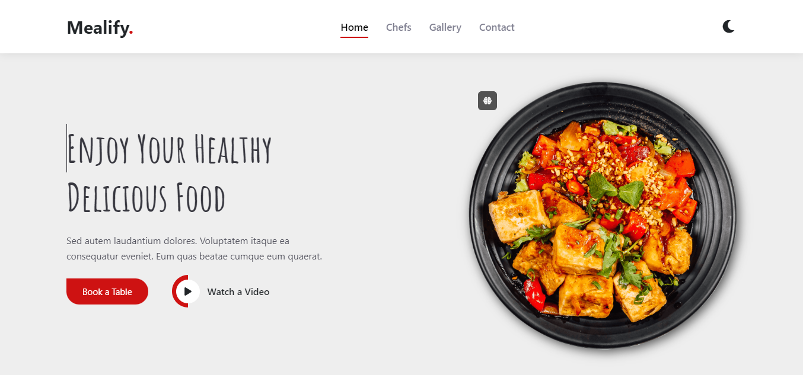
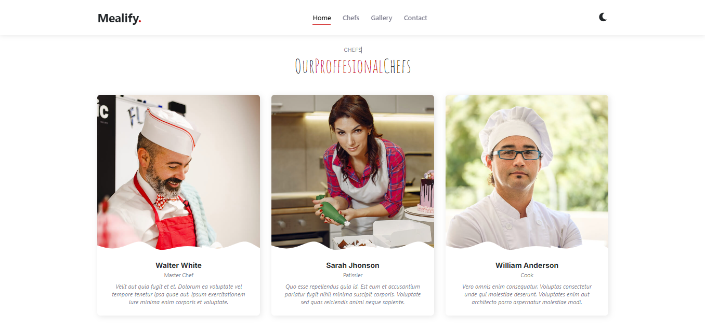
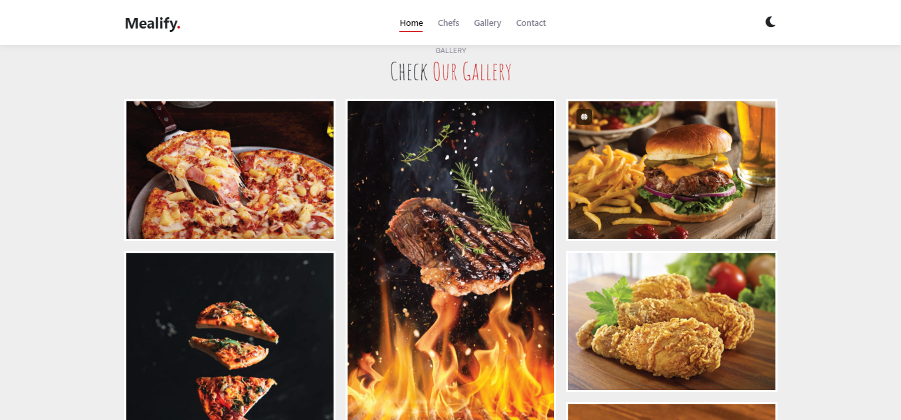

# Restaurant Mealify





## About:
Restaurant Mealify is an interactive web application that allows users to explore delicious meal recipes. The application features a sleek user interface with smooth animations that enhance the user experience.

## Features

- **Browse Multiple Recipes**: Explore a diverse collection of recipes with comprehensive details for each one.
- **Interactive Experience**: Enjoy seamless animations that make interacting with the app enjoyable.
- **Responsive Design**: The application works great on all devices, from smartphones to tablets and desktops.
-  **Dark Mode**: Switch to dark mode for a more comfortable viewing experience in low-light environments.

## Usage:
- Toggle Dark Mode: Use the dark mode toggle button to switch between light and dark themes for comfortable reading.
- Enjoy the Interactive Experience: Notice the animations that occur while browsing, enhancing the overall user experience

## Technologies Used
- HTML5: For structuring the webpage.
- CSS3: For styling , aesthetics  && Animation.
- JavaScript: For adding interactivity and dynamic functionality.
- Bootstrap: To facilitate responsive UI designs.

  ## Demo
You can view the live demo of the application [here](https://nourkuktut.github.io/restaurantMealify/).


## Installation

1. **Clone the repository**:
   ```bash
   git clone https://github.com/username/repository-name.git

2. Navigate to the project directory:
   ```bash
         cd restaurantMealify
3. Open the index.html file in your browser or run a live server for development:
     ```bash
           open index.html
## Author: **Nour kutkut**
## Contact:
For inquiries about this project or similar development services, feel free to contact me:
<br>
**Linkedin: [here](https://www.linkedin.com/in/nourkutkut).**
<br>
**Email:nourkutkut12@gmail.com**
